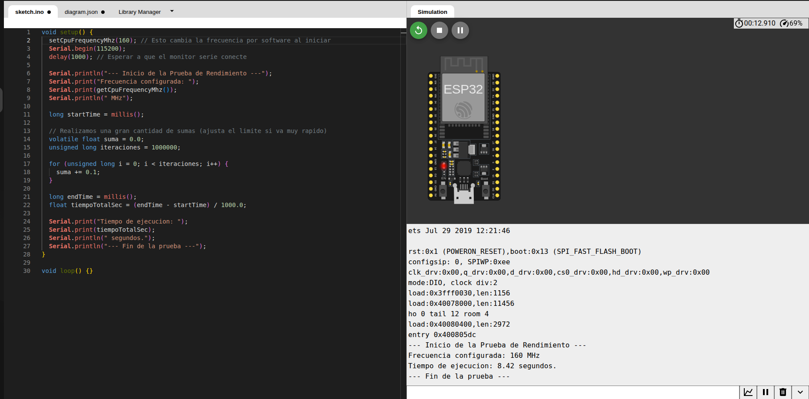
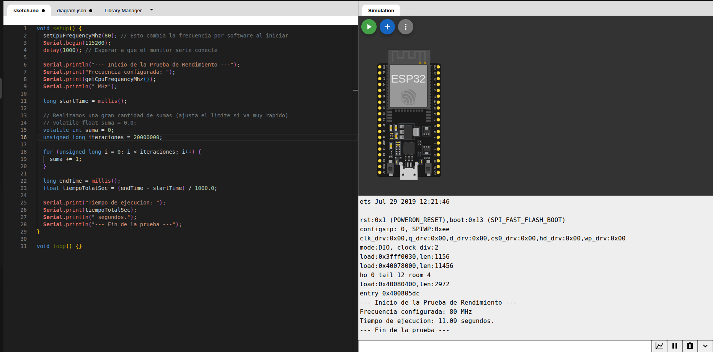

# Informe de Práctico: Análisis de Frecuencia y Rendimiento (ESP32)

## 1. Objetivo
Evaluar el impacto de la variación de la frecuencia de reloj en el tiempo de ejecución de un programa, comparando operaciones de punto flotante (**float**) y números enteros (**int**) en un entorno simulado.

## 2. Metodología
Se utilizó el simulador **Wokwi** con una placa **ESP32 DevKit V4**. Se ejecutó un bucle de sumas sucesivas bajo cuatro escenarios distintos, modificando la frecuencia del procesador mediante el comando `setCpuFrequencyMhz()`.

## 3. Resultados Obtenidos

A continuación, se detallan los tiempos medidos según las capturas de pantalla del simulador:

### Tabla de Mediciones

| Tipo de Operación | Frecuencia (MHz) | Cantidad de Iteraciones | Tiempo de Ejecución | Captura de Pantalla |
| :--- | :--- | :--- | :--- | :--- |
| **Suma Flotante** | 80 MHz | 1.000.000 | **8.50 segundos** | `float-80mhz.png` |
| **Suma Flotante** | 160 MHz | 1.000.000 | **8.42 segundos** | `float-160mhz.png` |
| **Suma Entera** | 80 MHz | 20.000.000 | **11.09 segundos** | `int-80mhz.png` |
| **Suma Entera** | 160 MHz | 20.000.000 | **10.99 segundos** | `int-160mhz.png` |

---

## 4. Evidencia Visual

### Pruebas con Punto Flotante (Float)

*Figura 1: Ejecución a 80 MHz con 1.000.000 de iteraciones.*

*Figura 2: Ejecución a 160 MHz con 1.000.000 de iteraciones.*

### Pruebas con Números Enteros (Int)

*Figura 3: Ejecución a 80 MHz con 20.000.000 de iteraciones.*

*Figura 4: Ejecución a 160 MHz con 20.000.000 de iteraciones.*

---

## 5. Análisis de los Resultados

### Variación de la Frecuencia
Teóricamente, al duplicar la frecuencia de **80 MHz** a **160 MHz**, el tiempo de ejecución debería reducirse a la mitad ($T_{final} = \frac{T_{inicial}}{2}$). Sin embargo, en las capturas se observa que el tiempo permanece casi constante.

**Causas técnicas:**
* **Limitación del Simulador:** En Wokwi, la velocidad de ejecución está ligada al motor de simulación del navegador. Cuando la operación es muy simple, el cuello de botella es la sincronización del simulador y no la capacidad física del silicio.

### Comparación: Enteros vs. Flotantes
* **Uso de FPU:** El ESP32 posee una **FPU (Floating Point Unit)** integrada. Esto explica por qué las sumas de decimales son tan eficientes, acercándose notablemente al rendimiento de los enteros, algo que no ocurre en microcontroladores de gama baja sin hardware dedicado.

## 6. Conclusión
Se concluye que, si bien en hardware real la reducción del tiempo sería proporcional al aumento de frecuencia, en el entorno virtual de Wokwi los tiempos tienden a estabilizarse debido a la sincronización de la simulación. No obstante, la prueba demuestra la alta capacidad del ESP32 para procesar grandes volúmenes de datos numéricos de manera consistente.