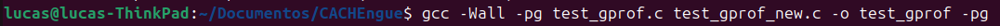
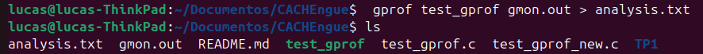
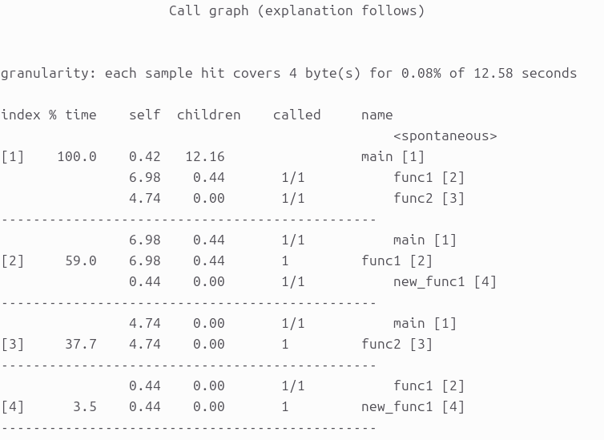
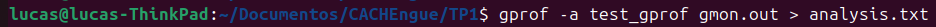
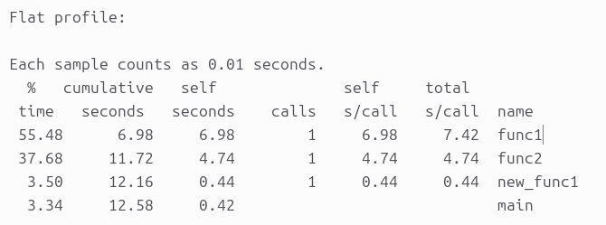
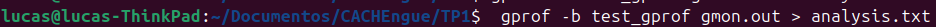
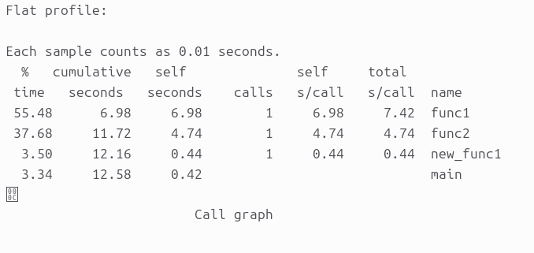
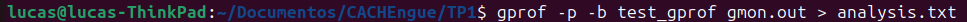
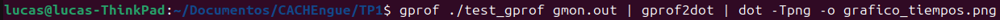

# Parte 1: Benchmarks

## ¿Qué es un benchmark?

Un benchmark es un programa o conjunto de programas diseñado para medir el rendimiento de un sistema bajo condiciones controladas y reproducibles. A diferencia de medir el tiempo de ejecución de un programa cualquiera, los benchmarks están construidos para estresar componentes específicos del hardware (CPU, memoria, disco, GPU) y permitir comparaciones entre distintos sistemas.

Existen distintos tipos de benchmarks:

- **Sintéticos**: programas pequeños diseñados específicamente para cargar un componente. Son fáciles de reproducir pero pueden no reflejar el uso real.
- **De núcleo (kernel benchmarks)**: extraen las partes computacionalmente intensivas de aplicaciones reales.
- **Programas reales**: ejecutan aplicaciones completas como compiladores, motores de renderizado o simuladores. Son los más representativos pero también los más difíciles de estandarizar.

---

## Lista de benchmarks seleccionados

A continuación se presenta una tabla con los benchmarks considerados más relevantes para el perfil de uso personal, que incluye compilación de código, gaming y uso general del sistema.

| Tarea diaria | Benchmark |
|---|---|
| Compilar proyectos (C, Python, etc.) | [Build Linux Kernel](https://openbenchmarking.org/test/pts/build-linux-kernel) |
| Jugar videojuegos | Cinebench R23 / Unigine Heaven | 
| Navegar por la web, múltiples pestañas | [7-Zip Compression](https://openbenchmarking.org/test/pts/compress-7zip) | 
| Ejecutar pruebas automatizadas / CI | [Build GCC](https://openbenchmarking.org/test/pts/build-gcc) | 
| Uso general del sistema operativo | [OpenSSL](https://openbenchmarking.org/test/pts/openssl) | 

---

## ¿Cuáles serían más útiles?

**Build Linux Kernel** es el más útil para el perfil de desarrollador. Compilar el kernel de Linux es una tarea real que involucra miles de archivos fuente, requiere un compilador optimizado y estresa simultáneamente la CPU, la memoria y el sistema de almacenamiento.

**7-Zip Compression** es igualmente representativo para el uso general del sistema. La compresión y descompresión de archivos es una tarea frecuente que combina acceso a memoria, cómputo intensivo y operaciones de E/S.

**Para gaming** en este caso, herramientas externas como 
**Cinebench R23** (que mide rendimiento de renderizado 3D, representativo de la carga de CPU en juegos) o **3DMark** (que evalúa la GPU con cargas similares a las de un motor de videojuego moderno) son más apropiadas.

---

## Rendimiento para compilar el kernel de Linux

A continuación se analiza el rendimiento de los procesadores indicados en la consigna utilizando los resultados públicos disponibles en [openbenchmarking.org/test/pts/build-linux-kernel-1.15.0](https://openbenchmarking.org/test/pts/build-linux-kernel-1.15.0).

Los procesadores evaluados son:

- **Intel Core i5-13600K** (referencia base)
- **AMD Ryzen 9 5900X 12-Core**
- **AMD Ryzen 9 7950X 16-Core** (sistema mejorado)

| Procesador | Tiempo promedio (s)|
|---|---|
|Intel Core i5-13600K | 846 +/- 61 |
|AMD Ryzen 9 5900X 12-Core | 901 +/- 77 |
|AMD Ryzen 9 7950X 16-Core | 512 +/- 33 |

### Cálculo de Speedup

El speedup mide la ganancia de rendimiento del sistema mejorado respecto al original:

$$Speedup = \frac{EX_{CPU\,Original}}{EX_{CPU\,Mejorado}} = \frac{T_{i5\text{-}13600K}}{T_{7950X}} = 1.65$$

### Cálculo de Eficiencia

La eficiencia mide qué tan bien se aprovechan los recursos adicionales (en este caso, núcleos):

$$Eficiencia = \frac{Speedup_n}{n} = 2.42$$

donde $n$ es la cantidad de núcleos del procesador mejorado respecto al de referencia.

---

# Parte 2: gprof

## **Paso 1: creación de perfiles habilitada durante la compilación**

En este primer paso, debemos asegurarnos de que la generación de perfiles esté habilitada cuando se complete la compilación del código. Esto es posible al agregar la opción '-pg' en el paso de compilación.  
Entonces, compilemos nuestro código con la opción '-pg':

**$ gcc \-Wall \-pg test\_gprof.c test\_gprof\_new.c \-o test\_gprof**

## **Paso 2: Ejecutar el código**

En el segundo paso, se ejecuta el archivo binario producido como resultado del paso 1 (arriba) para que se pueda generar la información de perfiles.

**$ ls**  
**$ ./test\_gprof**   
**$ ls**

Entonces vemos que cuando se ejecuta el binario, se genera un nuevo archivo 'gmon.out' en el directorio de trabajo actual.

## **Paso 3: Ejecute la herramienta gprof**

En este paso, la herramienta gprof se ejecuta con el nombre del ejecutable y el 'gmon.out' generado anteriormente como argumento. Esto produce un archivo de análisis que contiene toda la información de perfil deseada.

**$  gprof test\_gprof gmon.out \> analysis.txt**  
**$ ls**

Entonces vemos que se generó un archivo llamado 'analysis.txt'.

### **Comprensión de la información de perfil**

Cómo se produjo anteriormente, toda la información de perfil ahora está presente en 'analysis.txt'. Echemos un vistazo a este archivo de texto:

* **%** el porcentaje del tiempo total de funcionamiento del programa de tiempo utilizado para esta función.  
* **cumulative** una suma corriente del número de segundos contabilizados, segundos por esta función y las enumeradas anteriormente.  
* **self** el número de segundos contabilizados por este los segundos funcionan solos. Este es el tipo principal para este listado.  
* **calls** al número de veces que se invocó esta función, si esta función está perfilada, de lo contrario en blanco.  
* **self** el número promedio de milisegundos gastados en este ms/función de llamada por llamada, si esta función está perfilada, de lo contrario en blanco.  
* **total** el número promedio de milisegundos gastados en este función ms/call y sus descendientes por llamada, si esto la función está perfilada, de lo contrario, en blanco.  
* **name** el nombre de la función. Este es el tipo menor para este listado. El índice muestra la ubicación de la función en la lista de gprof. Si el índice es entre paréntesis muestra dónde aparecería en el listado de gprof si fuera a ser impreso.

Esta tabla describe el árbol de llamadas del programa y fue ordenada por la cantidad total de tiempo empleado en cada función y sus hijos.

Cada entrada en esta tabla consta de varias líneas. La línea con el número de índice en el margen izquierdo enumera la función actual. Las líneas arriba enumeran las funciones que llamaron a esta función, y las líneas debajo enumeran las funciones a las que llama.  
Esta línea enumera:

* **index** :un número único dado a cada elemento de la tabla. Los números de índice se ordenan numéricamente. El número de índice está impreso al lado de cada nombre de función para que es más fácil buscar dónde está la función en la tabla.  
* **% time** :este es el porcentaje del tiempo 'total' que se dedicó en esta función y sus hijos. Tenga en cuenta que debido a diferentes puntos de vista, funciones excluidas por opciones, etc. estos números NO sumarán 100%.  
* **self** :esta es la cantidad total de tiempo empleado en esta función.  
* **children :**esta es la cantidad total de tiempo propagado en esta función por sus hijos.  
* **calls** :este es el número de veces que se llamó a la función. Si la función se llama a sí misma recursivamente, el número solo incluye llamadas no recursivas, y es seguido por un \`+' y el número de llamadas recursivas.  
* **name** :el nombre de la función actual. El número de índice es impreso después de él. Si la función es miembro de un ciclo, el número de ciclo se imprime entre el nombre de la función y el número de índice.

Para los padres de la función, los campos tienen los siguientes significados:

* **self** :esta es la cantidad de tiempo que se propagó directamente de la función a este padre.  
* **childs** :esta es la cantidad de tiempo que se propagó desde los hijos de la función en este padre.  
* **calls** :este es el número de veces que este padre llamó al función \`/' el número total de veces que la función fue llamada. Las llamadas recursivas a la función no son incluidas en el número después de \`/'.  
* **name** :este es el nombre del padre. El índice de los padres el número se imprime después. Si el padre es un miembro de un ciclo, el número de ciclo se imprime entre el nombre y el número de índice.

Si no se pueden determinar los padres de la función, la palabra \`' está impreso en el campo \`nombre', y todos los demás campos están en blanco.

Para los hijos de la función, los campos tienen los siguientes significados:

* **self** :esta es la cantidad de tiempo que se propagó directamente del hijo a la función.  
* **children** :esta es la cantidad de tiempo que se propagó desde el los hijos del hijo a la función.  
* **called** :este es el número de veces que la función llamada este hijo \`/' el número total de veces que el hijo fue llamado Las llamadas recursivas del hijo no son aparece en el número después de \`/'.  
* **name** :este es el nombre del hijo. el índice del hijo el número se imprime después. Si el hijo es miembro de un ciclo, el número de ciclo se imprime entre el nombre y el número de índice.

Si hay ciclos (círculos) en el gráfico de llamadas, hay un entrada para el ciclo como un todo. Esta entrada muestra quién llamó al ciclo (como padres) y los miembros del ciclo (como hijos).  
La entrada de llamadas recursivas \`+' muestra el número de llamadas de función que eran internos al ciclo, y la entrada de llamadas para cada miembro muestra, para ese miembro, ¿cuántas veces fue llamado de otros miembros de el ciclo.

Como ya se ha comentado, este archivo se divide en dos partes principales:  
1\. Perfil plano

2\. Gráfico de llamadas  
Las columnas individuales (tanto del perfil plano como del gráfico de llamadas) se explican detalladamente en el propio archivo de salida.

### **1\. Suprima la impresión de funciones declaradas estáticamente (privadas) usando \-a**  **$ gprof \-a test\_gprof gmon.out \> analysis.txt** 

  
...  
...  
...  
  
...  
...  
…

Entonces vemos que no hay información relacionada con func2 (que se define como estática)

### **2\. Elimine los textos detallados usando \-b**

**$ gprof \-b test\_gprof gmon.out \> analysis.txt**

### **3\. Imprima solo perfil plano usando \-p**

**$ gprof \-p \-b test\_gprof gmon.out \> analysis.txt**

**4\. Imprimir información relacionada con funciones específicas en perfil plano**

**$ gprof \-pfunc1 \-b test\_gprof gmon.out \> analysis.txt**

## **Genere un gráfico** 

gprof2dot es una herramienta que puede crear una visualización de la salida de gprof. 

instalar gprof2dot:   
**$ pip install gprof2dot** 

instalar graphviz (que es necesario si va a hacer gráficos de "puntos" como el siguiente):   
**$sudo apt install graphviz** 

## **Conclusión del Análisis de Time Profiling**

Al contrastar el gráfico de llamadas (call graph) generado por **`gprof2dot`** con el código fuente en C, podemos confirmar que la distribución del tiempo de CPU es directamente proporcional a la carga de procesamiento (en este caso, la cantidad de iteraciones) asignada a cada función.

Las observaciones principales son:

* **Relación directa entre iteraciones y tiempo de CPU:** La función **`func1`** es el cuello de botella principal del programa, consumiendo el **58.98%** del tiempo total. Al revisar el código (**`test_gprof.c`**), vemos que esto se debe a que contiene el bucle **`for`** con la mayor cantidad de iteraciones: **`0xffffffff`** (más de 4.290 millones de ciclos). Su "tiempo propio" del **55.48%** refleja exactamente el tiempo que la CPU pasó resolviendo ese bucle específico.  
* **Procesos secundarios:** La función **`func2`** consume un **37.68%** del tiempo de ejecución. Esto tiene un sentido lógico perfecto al ver su código, ya que su bucle itera hasta **`0xafffffff`** (aprox. 2.950 millones de ciclos). Al ser un número menor que el de **`func1`**, el tiempo de CPU requerido disminuye en la misma proporción.  
* **Comprobación de llamadas anidadas:** El gráfico muestra correctamente una llamada desde **`func1`** hacia **`new_func1`** que representa un **3.50%** del tiempo total. El código fuente confirma esta estructura: **`func1`** invoca a **`new_func1()`** inmediatamente después de terminar su propio bucle. Como **`new_func1`** tiene un límite de iteración mucho menor (**`0xfffff66`**, unos 268 millones de ciclos), su impacto en el tiempo global del programa es mínimo, tal como lo refleja el gráfico.

**Resumen:** La herramienta de profiling logró mapear con total precisión el comportamiento del código fuente. Queda demostrado que para optimizar el tiempo de ejecución de este programa, cualquier modificación debería enfocarse primero en reducir la complejidad computacional del bucle principal dentro de **`func1`**.

# Parte 3: ESP32

## 1. Objetivo
Evaluar el impacto de la variación de la frecuencia de reloj en el tiempo de ejecución de un programa, comparando operaciones de punto flotante (**float**) y números enteros (**int**) en un entorno simulado.

## 2. Metodología
Se utilizó el simulador **Wokwi** con una placa **ESP32 DevKit V4**. Se ejecutó un bucle de sumas sucesivas bajo cuatro escenarios distintos, modificando la frecuencia del procesador mediante el comando `setCpuFrequencyMhz()`.

## 3. Resultados Obtenidos

A continuación, se detallan los tiempos medidos según las capturas de pantalla del simulador:

### Tabla de Mediciones

| Tipo de Operación | Frecuencia (MHz) | Cantidad de Iteraciones | Tiempo de Ejecución | Captura de Pantalla |
| :--- | :--- | :--- | :--- | :--- |
| **Suma Flotante** | 80 MHz | 1.000.000 | **8.50 segundos** | `float-80mhz.png` |
| **Suma Flotante** | 160 MHz | 1.000.000 | **8.42 segundos** | `float-160mhz.png` |
| **Suma Entera** | 80 MHz | 20.000.000 | **11.09 segundos** | `int-80mhz.png` |
| **Suma Entera** | 160 MHz | 20.000.000 | **10.99 segundos** | `int-160mhz.png` |

---

## 4. Evidencia Visual

### Pruebas con Punto Flotante (Float)

*Figura 1: Ejecución a 80 MHz con 1.000.000 de iteraciones.*

*Figura 2: Ejecución a 160 MHz con 1.000.000 de iteraciones.*

### Pruebas con Números Enteros (Int)

*Figura 3: Ejecución a 80 MHz con 20.000.000 de iteraciones.*

*Figura 4: Ejecución a 160 MHz con 20.000.000 de iteraciones.*

---

## 5. Análisis de los Resultados

### Variación de la Frecuencia
Teóricamente, al duplicar la frecuencia de **80 MHz** a **160 MHz**, el tiempo de ejecución debería reducirse a la mitad ($T_{final} = \frac{T_{inicial}}{2}$). Sin embargo, en las capturas se observa que el tiempo permanece casi constante.

**Causas técnicas:**
* **Limitación del Simulador:** En Wokwi, la velocidad de ejecución está ligada al motor de simulación del navegador. Cuando la operación es muy simple, el cuello de botella es la sincronización del simulador y no la capacidad física del silicio.

### Comparación: Enteros vs. Flotantes
* **Uso de FPU:** El ESP32 posee una **FPU (Floating Point Unit)** integrada. Esto explica por qué las sumas de decimales son tan eficientes, acercándose notablemente al rendimiento de los enteros, algo que no ocurre en microcontroladores de gama baja sin hardware dedicado.

## Conclusiones Generales

A través de las tres metodologías aplicadas, se desprenden las siguientes observaciones generales sobre el rendimiento de los sistemas computacionales:

* **La especificidad de la medición**: Los **benchmarks** demuestran que no existe una métrica universal; el rendimiento es un valor relativo de acuerdo con la aplicación que se va a realizar. Mientras que para un desarrollador la compilación del kernel es la prueba más honesta, un entorno de gaming requiere evaluar la capacidad de renderizado. El rendimiento real siempre está condicionado por factores como la jerarquía de memoria y el sistema operativo.
* **La importancia de la visibilidad interna**: El uso de herramientas de **profiling** como `gprof` revela que la intuición del programador no siempre es suficiente para validar la eficiencia de un código. Identificar con precisión los "cuellos de botella" mediante el análisis del tiempo de CPU y el árbol de llamadas es fundamental para cualquier esfuerzo de optimización efectiva.
* **Abstracción vs. Realidad Física**: Las pruebas en el **ESP32** evidencian la brecha entre el rendimiento teórico y el simulado. Aunque la teoría dicta que el tiempo de programa es inversamente proporcional a la frecuencia ($T_{prog} \propto 1/f_{CPU}$), las limitaciones de sincronización en entornos virtuales y la eficiencia de componentes de hardware dedicado como la **FPU** demuestran que el aprovechamiento de los recursos depende directamente de la arquitectura del procesador y el entorno de ejecución.

