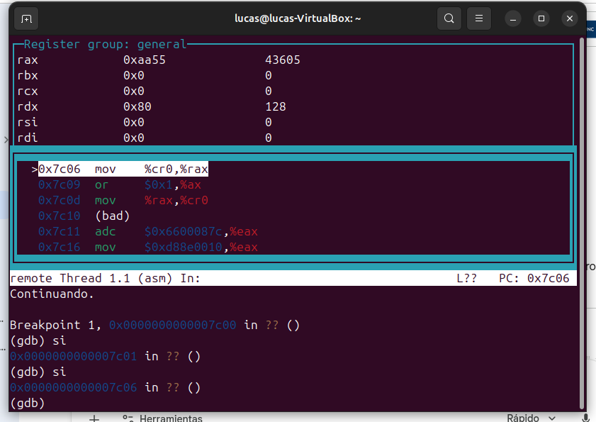
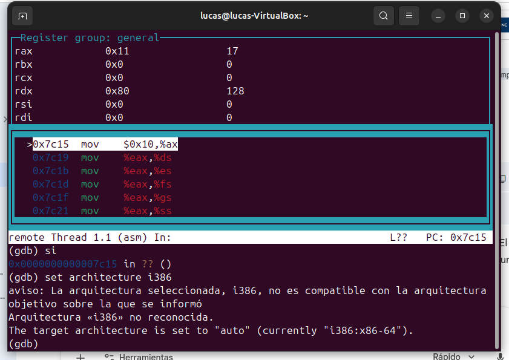
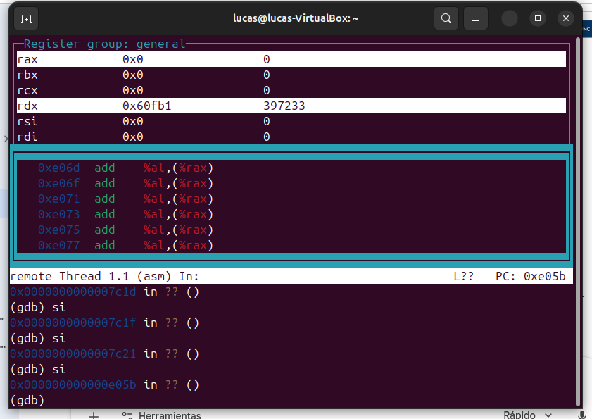

# TP3: Transición a Modo Protegido (x86)

Este proyecto demuestra la transición de un procesador x86 desde el **Modo Real** (16 bits) al **Modo Protegido** (32 bits), configurando manualmente la **GDT (Global Descriptor Table)** sin utilizar macros.

## 🛠️ Implementación y Secuencia de Activación

Para pasar a modo protegido, se realizó la siguiente secuencia lógica en ensamblador:
1.  **cli**: Desactivación de interrupciones.
2.  **lgdt**: Carga del registro GDTR con la dirección de nuestra tabla.
3.  **Activación del Bit PE**: Se lee el registro `CR0`, se activa el bit 0 (Protection Enable) y se vuelve a escribir.

*Captura 1: Manipulación de los registros de control para iniciar el cambio de modo.*

## 📂 Configuración de la GDT

Se definieron dos descriptores de memoria con espacios físicamente diferenciados para separar el código de los datos:
* **Descriptor de Código**: Base en `0x00000000`.
* **Descriptor de Datos**: Base en `0x00020000`.

Al realizar el **Far Jump** (`ljmp`), el procesador cambia su arquitectura interna para interpretar instrucciones de 32 bits.

*Captura 2: GDB detecta el cambio de arquitectura a i386 tras el salto largo.*

## 📊 Registros de Segmento en Modo Protegido

**Pregunta del TP: ¿Con qué valor se cargan los registros de segmento y por qué?**

En modo protegido, los registros de segmento (`DS`, `ES`, `FS`, `GS`, `SS`) se cargan con el valor **0x10**. 

**Razón:** Este valor no es una dirección de memoria, sino un **Selector de Segmento**. El valor `0x10` (16 en decimal) apunta al segundo descriptor de la GDT (8 bytes del nulo + 8 bytes del primer segmento). El procesador utiliza este índice para consultar la base, el límite y los permisos en la tabla antes de cada acceso a memoria.

*Captura 3: Se observa la carga del valor 0x10 en los registros de segmento.*

## 🧪 Experimento de Protección (Read-Only)

Se modificó el bit de acceso del segmento de datos a **Solo Lectura (`0x90`)** para testear la seguridad del hardware.

* **¿Qué sucede al intentar escribir?**: Al ejecutar la instrucción `movl $0xDEADBEEF, (0x0)`, el hardware detecta que el segmento no tiene permisos de escritura y genera una excepción de **Protección General (#GP)**.
* **Resultado**: Al no haber una tabla de interrupciones (IDT) que maneje el error, el CPU entra en **Triple Falta** y se reinicia automáticamente.

*Captura 4: El puntero de instrucción salta a la dirección del BIOS (0xe05b) tras el fallo de protección.*

## 🚀 Cómo ejecutar
1.  Entrar a la carpeta: `cd TP3`
2.  Compilar y correr: `./compilarycorrer`
3.  Para depurar: `gdb -ex "target remote :1234" -ex "layout asm"`
