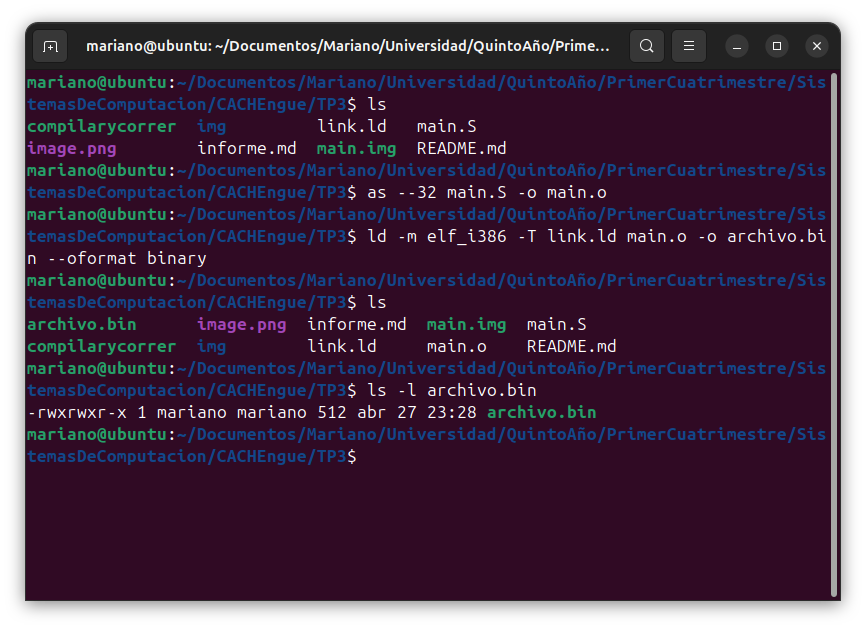
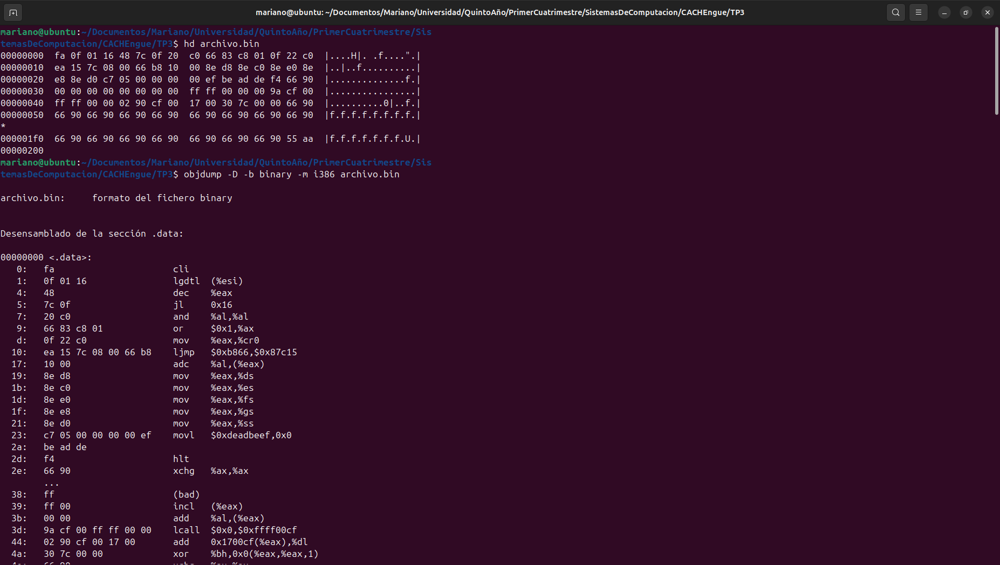
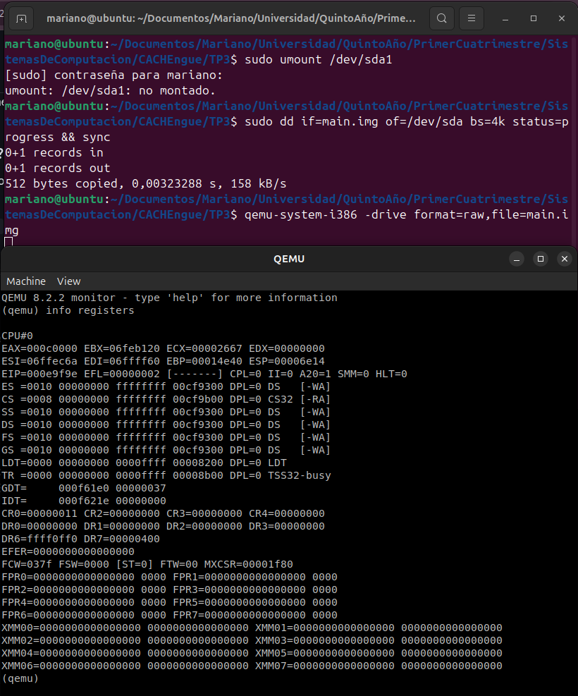
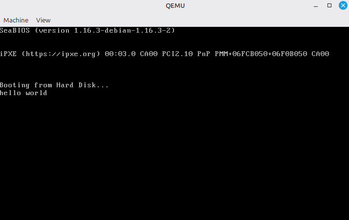
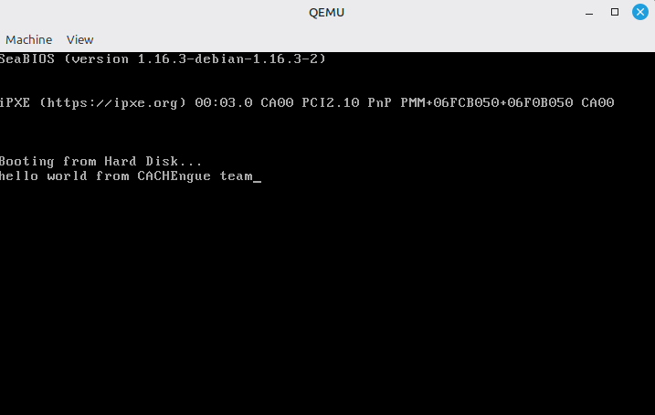
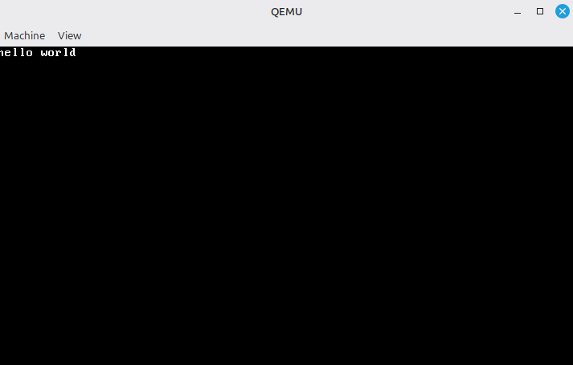
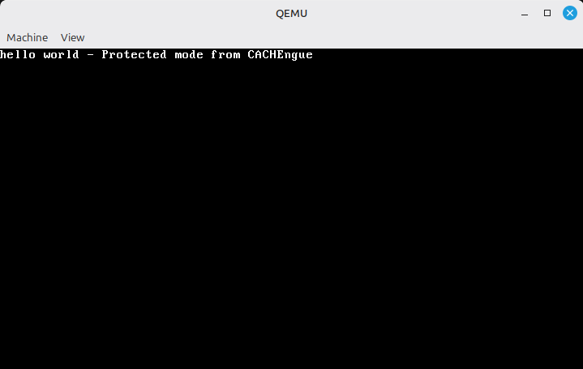
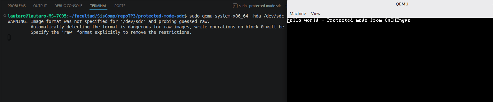

# Laboratorio 3: Compilar y correr una aplicación sin SO (Bare-metal)

## Parte 1

###  ¿Qué es UEFI y cómo se utiliza?
**UEFI (Unified Extensible Firmware Interface)** es una especificación que define una interfaz de software entre el sistema operativo y el firmware de la plataforma.

* **Uso:** A diferencia del BIOS que utiliza interrupciones de software, UEFI se basa en un modelo de **protocolos**. El programador interactúa con el firmware mediante tablas de servicios (`System Table`) que contienen punteros a funciones.
* **Función dinámica:** Una función característica que se puede llamar es `OutputString`. Esta pertenece al protocolo `SimpleTextOutput`.
    * **Ejemplo de llamada:** `SystemTable->ConOut->OutputString(SystemTable->ConOut, L"Texto en modo UEFI");`

---

###  Bugs de UEFI y Vulnerabilidades Explotables
Debido a que UEFI reside en la fase de **DXE (Driver Execution Environment)**, tiene acceso total al hardware antes de que el kernel del SO cargue sus protecciones.
* **BlackLotus:** Un *bootkit* que explota vulnerabilidades para eludir el **Secure Boot**, permitiendo la ejecución de código no firmado en las primeras etapas del arranque.
* **LogoFail:** Vulnerabilidad en los parsers de imagen del firmware. Al cargar un logo de fabricante malicioso durante el POST, el atacante puede ejecutar código con privilegios de firmware.
* **Ataques al SMM (System Management Mode):** Según el manual de Intel, el SMM es un modo altamente privilegiado. Existen bugs que permiten "saltar" desde UEFI al SMM, volviendo al atacante invisible para el sistema operativo.

---

###  Intel CSME e Intel MEBx
Estos componentes forman parte del ecosistema de seguridad y administración de los chipsets modernos de Intel:

* **Intel CSME (Converged Security and Management Engine):** Es un subsistema de hardware dedicado (un procesador independiente dentro del chipset) que ejecuta su propio firmware. Es el encargado de establecer la "Raíz de Confianza" (Root of Trust) de la plataforma, manejando el cifrado y el arranque seguro.
* **Intel MEBx (Management Engine BIOS Extension):** Es un módulo de configuración que se encuentra dentro de la interfaz del BIOS/UEFI. Permite al administrador configurar parámetros del motor de gestión (como contraseñas o acceso remoto) antes de que el sistema operativo inicie.


---

###  coreboot: Firmware de Código Abierto
Coreboot es un proyecto de software que busca reemplazar el firmware propietario (BIOS/UEFI) por una implementación minimalista que solo realiza la inicialización indispensable del hardware.

* **Ventajas:**
    1.  **Velocidad:** Reduce el tiempo de arranque al mínimo (pocos segundos).
    2.  **Seguridad:** Al ser código abierto, permite auditorías para descartar *backdoors*.
    3.  **Carga Útil (Payload):** Permite elegir qué cargar después (por ejemplo, iniciar directamente un kernel de Linux o usar SeaBIOS para compatibilidad).
* **Productos que lo incorporan:**
    * La mayoría de las **Chromebooks** de Google.
    * Dispositivos de fabricantes enfocados en seguridad como **Purism** (Librem) y **System76**.
    * Hardware de red y servidores de alta disponibilidad.


###  ¿Qué es un linker y qué hace?
El **linker** (o enlazador) es la herramienta del *toolchain* de compilación que combina uno o más archivos de objeto (generados por el ensamblador o compilador) para generar un único archivo ejecutable o un binario plano.

**Funciones principales:**
* **Resolución de símbolos:** Asocia las definiciones de funciones y variables con sus respectivas referencias en otros archivos (ej. conecta una llamada a una función con su implementación).
* **Asignación de secciones:** Organiza las secciones de código (`.text`), datos inicializados (`.data`) y datos no inicializados (`.bss`) en un diseño de memoria coherente.
* **Relocalización:** Ajusta las direcciones de memoria dentro del código para que coincidan con la dirección final donde el programa será cargado.


---

###  La dirección en el script del linker: ¿Qué es y por qué es necesaria?
En un linker script, la dirección (frecuentemente definida tras la instrucción `.` o el comando `ENTRY`) especifica la dirección base de carga o *VMA (Virtual Memory Address)*.

* **Por qué es necesaria:** El procesador x86, al ejecutar saltos absolutos o acceder a variables globales, necesita conocer la dirección exacta en la memoria física/virtual donde reside el dato. 
* **Ejemplo práctico:** En el desarrollo de un *bootloader* (visto en el TP de Modo Protegido), es imperativo que el linker sepa que el código se cargará en la dirección `0x7C00`. Si el script no define esta dirección, el linker podría asumir `0x0`, y al ejecutarse en `0x7C00`, todos los saltos a etiquetas fallarían.

---

###  Comparativa: `objdump` vs `hd` (Hexdump)
Para verificar la ubicación y contenido del programa dentro de la imagen binaria:

* **`objdump -D`:** Proporciona un desensamblado del binario. Muestra las instrucciones en lenguaje ensamblador junto con las direcciones lógicas y los símbolos. Permite entender la estructura lógica que el linker ha creado.
* **`hd` (o `hexdump`):** Muestra el contenido "crudo" (raw) del archivo en formato hexadecimal. No interpreta si un byte es una instrucción de CPU o un dato.
* **Verificación:** Al comparar ambos, se puede observar que el desplazamiento (offset) en el archivo mostrado por `hd` coincide con la secuencia de bytes (opcodes) que `objdump` identifica como instrucciones en una dirección de memoria específica.





---

###  Grabación en Pendrive y Prueba en Hardware
Para probar un binario de bajo nivel en una PC, se debe escribir el archivo directamente en el primer sector del dispositivo (MBR), ignorando cualquier sistema de archivos:

* **Comando de grabación (Linux):** `sudo dd if=imagen.bin of=/dev/sdX bs=512 count=1`  
    *(Donde `/dev/sdX` es la unidad del pendrive).*
* **Prueba:** Se debe configurar la BIOS/UEFI de la PC para arrancar desde el dispositivo USB en modo "Legacy". Si el código es correcto (termina con la firma `0xAA55`), el procesador cargará el código en `0x7C00` y comenzará la ejecución.

<!--- no pude acceder al pendrive desde la bios -->



---

###  ¿Para qué se utiliza la opción `--oformat binary`?
La opción `--oformat binary` del linker (`ld`) se utiliza para generar un binario plano (flat binary).

* **Diferencia con ELF/PE:** Normalmente, el linker genera archivos con cabeceras complejas (como ELF en Linux o PE en Windows) que el sistema operativo lee para saber cómo cargar el programa.
* **Importancia en Sistemas Operativos:** En el desarrollo de kernels o *bootloaders*, no existe un sistema operativo previo para leer cabeceras. El procesador simplemente lee bytes y los ejecuta. `--oformat binary` elimina todas las cabeceras y metadatos, dejando únicamente el código de máquina puro listo para ser copiado directamente a la memoria o al sector de arranque.

## Parte 2: Compilar y ejecutar los ejemplos

### Paso 1: Instalar qemu, compilar y ejecutar los ejemplos

**Ejecución de `bios_hello_world`:**
- Comandos ejecutados: 
  ```bash
  sudo apt install qemu-system-x86
  ./run bios_hello_world
  ```
- **Resultado:** Se ejecutó QEMU exitosamente usando las interrupciones de video del BIOS (modo real a 16 bits). En primer lugar, se corroboró el funcionamiento con el mensaje de prueba original. Posteriormente, tras modificar el código fuente en ensamblador (`bios_hello_world.S`), se volvió a compilar y ejecutar, logrando mostrar exitosamente por pantalla en el emulador nuestro mensaje personalizado.




**Ejecución de `protected_mode`:**
- Comandos ejecutados:
  ```bash
  ./run protected_mode
  ```
- **Resultado:** Al ejecutar este segundo programa, la CPU cambió a modo protegido (32 bits) de manera explícita y se escribió el mensaje original directamente sobre la memoria de video VGA (bypasseando por completo el sistema BIOS). A continuación, tal como se sugirió, modificamos el código fuente (`protected_mode.S`) con el mensaje `"hello world - Protected mode from CACHEngue"`. Volvimos a compilar mediante el script `run` y observamos en el emulador cómo se plasmó en pantalla el cambio esperado.





### Paso 2: Depurar los ejemplos
- Comandos ejecutados para depurar:
  ```bash
  ./run bios_hello_world debug
  ```
- **Observaciones de GDB:** Al ejecutar el modo depuración (y utilizando `gdb-dashboard`), la ejecución de QEMU se pausa y GDB se conecta de forma remota. Automáticamente, GDB inserta un *breakpoint* en la primera línea de ejecución del bootloader de la BIOS, que corresponde a la dirección de memoria `0x00007c00`. 
En la salida del depurador observamos que se detiene sobre la instrucción `BEGIN` del archivo `bios_hello_world.S`. El código máquina desensamblado muestra cómo este macro inicializa el entorno de 16 bits para el arranque, deshabilitando interrupciones (`cli`), haciendo un salto largo (`ljmp`) para asegurar el valor de `CS`, y procediendo a inicializar los demás registros de segmento (`DS`, `ES`, `FS`, `GS`, `SS`) a 0. A partir de acá, podemos utilizar herramientas de GDB como `stepi` o `nexti` para ejecutar el simulador instrucción a instrucción, visualizando en tiempo real cómo cambian los registros del procesador.

---

## Parte 3: Grabar la imagen y correrla en HW real

### Paso 1: Determinar el driver asignado al dispositivo
Para identificar el pendrive utilizamos el comando:
```bash
sudo fdisk -l | grep sd
```
- **Dispositivo identificado:** Tras analizar la salida, determinamos que los discos internos son `/dev/sda` (Windows de ~240GB) y `/dev/sdb` (Linux de ~1TB). Efectivamente el pendrive conectado corresponde al dispositivo **`/dev/sdc`** (con un tamaño de 14.91 GiB, formateado previamente en FAT32).

### Paso 2: Grabar la imagen de disco

- Comando utilizado para grabar en el pendrive:
  ```bash
  sudo dd if=x86-bare-metal-examples/protected_mode.img of=/dev/sdc bs=4M status=progress
  ```
*(Aseguramos colocar `/dev/sdc` como `of`, ya que equivocarse podría sobreescribir el disco principal).*

### Resultado en Hardware Real (Alternativa Virtualizada)
- **Comportamiento al bootear el pendrive físico:** Debido a las configuraciones de hardware moderno (UEFI y Secure Boot) requeridas para correr un entorno Dual Boot con Windows y Linux Mint, alterar la BIOS hacia modo Legacy (MBR) resultaba contraproducente y riesgoso para el sistema anfitrión.
Para sortear este obstáculo y aún así comprobar empíricamente que el dispositivo físico fue flasheado de manera correcta como medio de arranque, optamos por utilizar QEMU para leer y bootear directamente el bloque de hardware del pendrive (y no la imagen `.img` local).

Esto se logró ejecutando el emulador con privilegios para leer nuestra unidad `/dev/sdc`:
```bash
sudo qemu-system-x86_64 -hda /dev/sdc
```

**Resultado:** QEMU leyó exitosamente el Master Boot Record (MBR) que plasmamos en el pendrive real y procedió a arrancar la aplicación bare-metal. Verificamos que el emulador pasó a modo protegido (32 bits) imprimiendo el texto modificado en pantalla de manera instantánea, dejando en evidencia que el dispositivo USB físico es efectivamente booteable.


