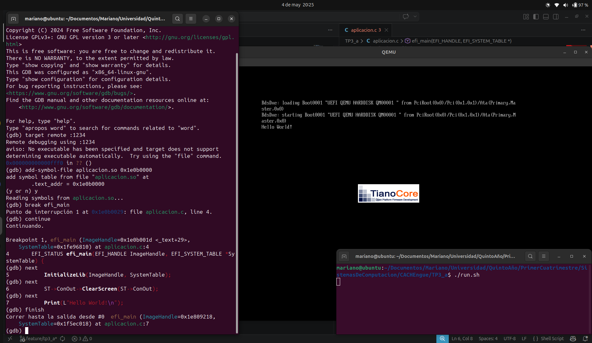
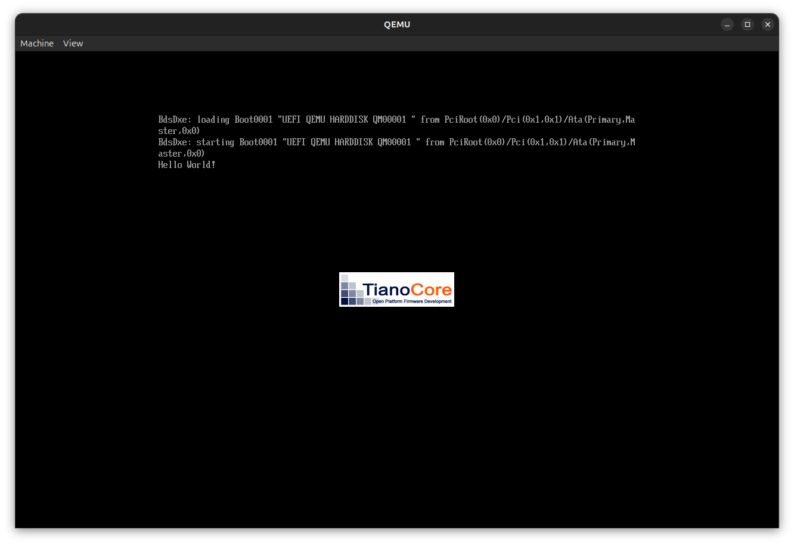

# TP3_a - Entorno UEFI: Hello World y Depuración con GDB

## Objetivo

Desarrollar una aplicación nativa UEFI en C que imprima "Hello World" en pantalla, compilarla al formato PE/COFF, ejecutarla en un entorno emulado con QEMU/OVMF y depurarla en tiempo real usando GDB con remote debugging.

---

## Entorno de trabajo

- Sistema operativo host: Ubuntu 24.04
- Emulador: QEMU (`qemu-system-x86_64`)
- Firmware: OVMF (`/usr/share/ovmf/OVMF.fd`)
- Toolchain: `gcc`, `ld`, `objcopy` con soporte `gnu-efi`
- Depurador: GDB 15.1

---

## Código fuente

**`aplicacion.c`**

```c
#include <efi.h>
#include <efilib.h>

EFI_STATUS efi_main(EFI_HANDLE ImageHandle, EFI_SYSTEM_TABLE *SystemTable) {
    InitializeLib(ImageHandle, SystemTable);
    ST->ConOut->ClearScreen(ST->ConOut);
    Print(L"Hello World!\n");
    for(;;) {}
    return EFI_SUCCESS;
}
```

Se utiliza `InitializeLib` para inicializar las variables globales de la librería `gnu-efi`, entre ellas `ST` (puntero global a la `EFI_SYSTEM_TABLE`). La función `Print` de la librería escribe texto en la consola de video de UEFI. El bucle infinito al final evita que el sistema se reinicie.

---

## Compilación

**`build_efi.sh`**

```bash
echo "Compilando..."

# 1. Compilar a codigo objeto con informacion de debug
gcc -g -I/usr/include/efi -I/usr/include/efi/x86_64 -I/usr/include/efi/protocol \
    -fpic -ffreestanding -fno-stack-protector -fno-strict-aliasing \
    -fshort-wchar -mno-red-zone -maccumulate-outgoing-args \
    -Wall -c -o aplicacion.o aplicacion.c

# 2. Linkear como shared object ELF
ld -shared -Bsymbolic -L/usr/lib -L/usr/lib/efi \
    -T/usr/lib/elf_x86_64_efi.lds \
    /usr/lib/crt0-efi-x86_64.o aplicacion.o \
    -o aplicacion.so -lefi -lgnuefi

# 3. Convertir a formato PE/COFF (ejecutable EFI)
objcopy -j .text -j .sdata -j .data -j .dynamic -j .dynsym \
        -j .rel -j .rela -j .rel.* -j .rela.* -j .reloc \
        --target efi-app-x86_64 aplicacion.so aplicacion.efi

echo "Desplegando al disco virtual..."
mkdir -p hdd/EFI/BOOT
cp aplicacion.efi hdd/EFI/BOOT/BOOTX64.EFI

echo "Build completado con exito!"
```

UEFI utiliza el formato PE/COFF (el mismo de los ejecutables de Windows) incluso compilando desde Linux. El proceso tiene tres etapas: compilar a objeto ELF, linkear como shared object ELF (que conserva los símbolos de debug), y convertir al formato PE/COFF mediante `objcopy`. El archivo `.so` intermedio se conserva porque contiene la tabla de símbolos necesaria para GDB.

---

## Ejecución en QEMU

**`run.sh`**

```bash
qemu-system-x86_64 -m 512 \
  -bios /usr/share/ovmf/OVMF.fd \
  -drive file=fat:rw:hdd,format=raw,media=disk \
  -net none \
  -display gtk \
  -s -S
```

Los flags relevantes:

- `-bios /usr/share/ovmf/OVMF.fd`: carga el firmware UEFI open source OVMF en lugar del BIOS legacy.
- `-drive file=fat:rw:hdd,format=raw,media=disk`: expone el directorio `hdd/` como un disco FAT32 virtual. UEFI detecta automáticamente el ejecutable en `EFI/BOOT/BOOTX64.EFI`.
- `-s`: habilita el servidor GDB en el puerto 1234.
- `-S`: arranca el CPU pausado, esperando que GDB se conecte antes de ejecutar ninguna instrucción.

Al arrancar, QEMU muestra la pantalla de UEFI con el logo de TianoCore y ejecuta la aplicación, que imprime "Hello World!" en pantalla.

---

## Depuración con GDB

### El problema de la dirección base

UEFI carga la aplicación en una dirección de RAM elegida dinámicamente en cada arranque. GDB necesita saber en qué dirección quedó cargado el binario para poder resolver los símbolos (nombres de funciones, números de línea) del archivo `.so`. Sin esta información, GDB puede conectarse al proceso pero no puede asociar las instrucciones de máquina con las líneas del código fuente.

El comando `add-symbol-file` le indica a GDB dónde cargar la tabla de símbolos del `.so` y a qué dirección de RAM corresponde la sección `.text` (donde vive el código ejecutable):

```
add-symbol-file aplicacion.so 0x1e0b0000
```

- `aplicacion.so` es el archivo ELF intermedio generado durante la compilación. A diferencia del `.efi` final, el `.so` conserva la tabla de símbolos con los nombres de funciones y la correspondencia entre instrucciones y líneas de código fuente.
- `0x1e0b0000` es la dirección de RAM donde UEFI cargó la sección `.text` de la aplicación en esta sesión. Una vez cargados los símbolos en esa dirección, GDB puede resolver `efi_main` y cualquier otra función definida en el código.

### Flujo completo de depuración

Con QEMU corriendo (pausado con `-S`), en una segunda terminal desde la carpeta del proyecto:

```bash
gdb
```

```
(gdb) target remote :1234
(gdb) add-symbol-file aplicacion.so 0x1e0b0000
(gdb) break efi_main
(gdb) continue
```

GDB detiene la ejecución al entrar en `efi_main` y muestra el código fuente:

```
Breakpoint 1, efi_main (ImageHandle=0x1e0b001d, SystemTable=0x1fe96810)
    at aplicacion.c:4
4       EFI_STATUS efi_main(EFI_HANDLE ImageHandle, EFI_SYSTEM_TABLE *SystemTable) {
```

A partir de ahí se puede avanzar línea por línea con `next` y observar cómo cada instrucción afecta la pantalla de QEMU. Al ejecutar el `Print`, aparece "Hello World!" en la ventana del emulador.

---

## Capturas

### Depuracion en GDB con breakpoint en efi_main

GDB conectado a QEMU via remote debugging, con los símbolos cargados y un breakpoint activo en `efi_main`. Se puede ver el código fuente y avanzar línea por línea.



### Hello World en QEMU

Resultado final: la aplicación UEFI imprime "Hello World!" directamente en la consola del firmware, fuera de cualquier sistema operativo.

