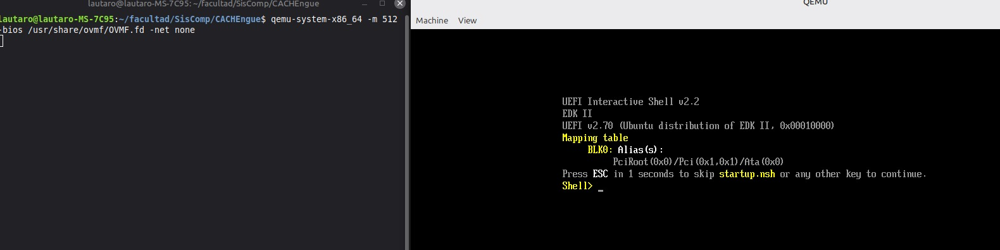
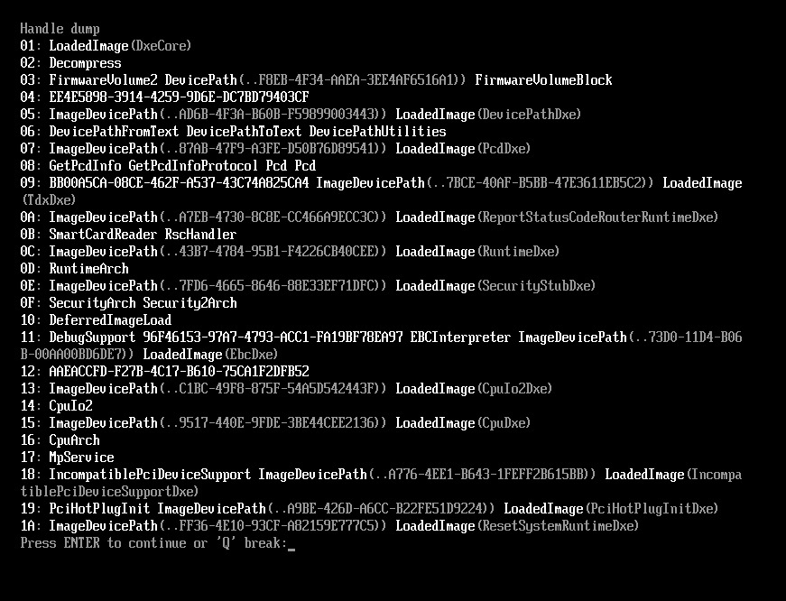
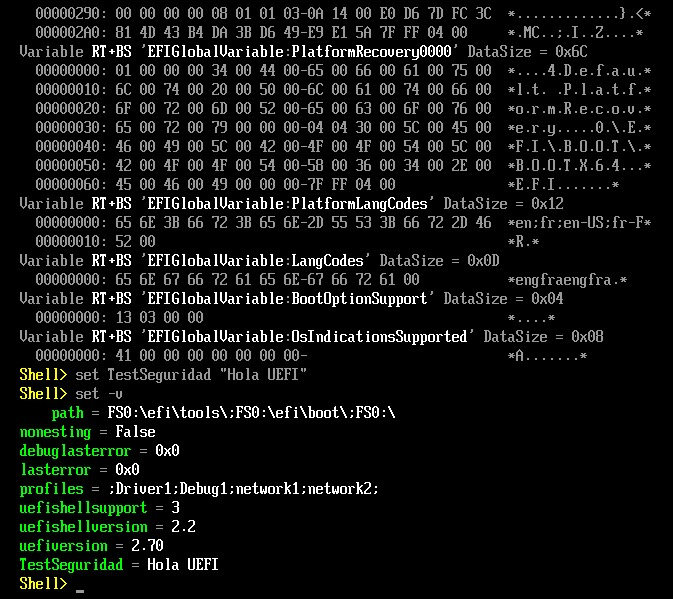
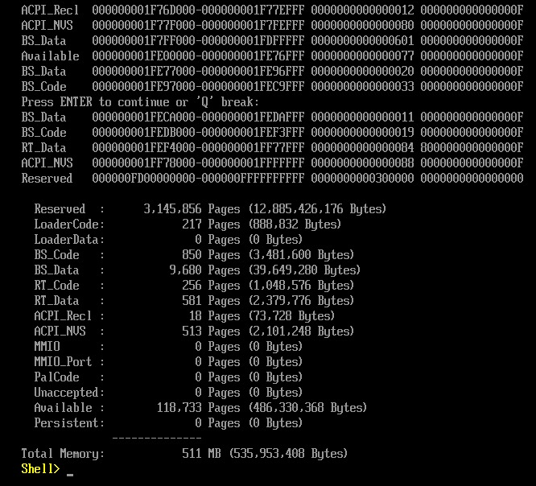
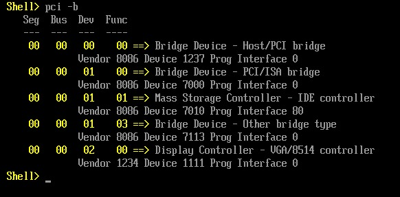
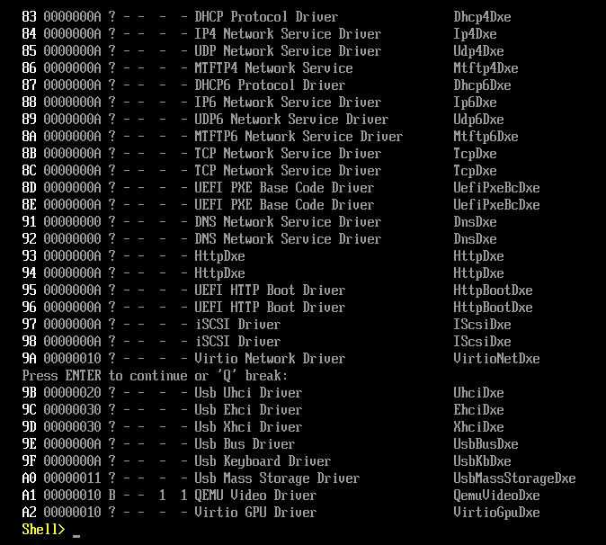
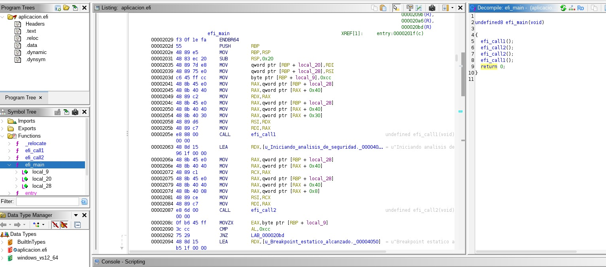
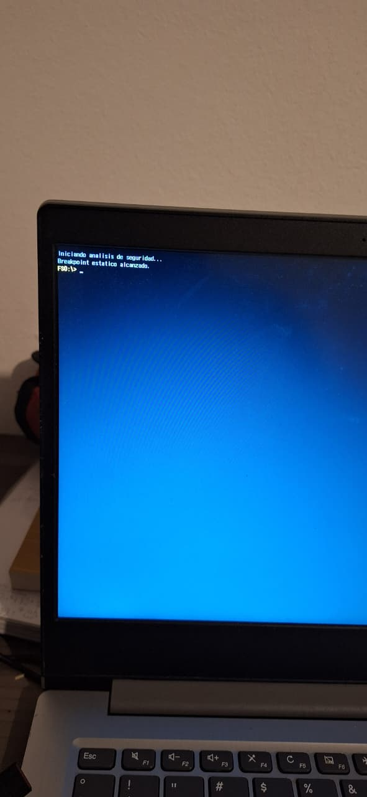
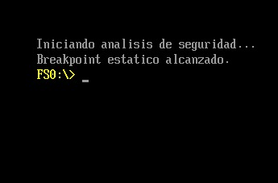

# TP3\_a - Arquitectura y Fundamentos del Firmware UEFI

Este directorio documenta el avance y la resolución de las consignas prácticas de Arquitectura y Sistemas de Computación relacionadas con UEFI. Integramos los requerimientos del documento base con el *troubleshooting* documentado.

## Herramientas Instaladas y Troubleshooting

Para llevar a cabo los trabajos prácticos se configuró un entorno con QEMU, OVMF (firmware UEFI abierto), herramientas de compilación cruzada, y Ghidra para ingeniería inversa.

**Instalación manual de Ghidra:**
Durante la configuración en sistemas basados en Ubuntu/Linux Mint, `ghidra` no se encontró de forma predeterminada en los repositorios de `apt` y no existía soporte instalado para `snap`. La solución adecuada fue:
1. Instalar un Java compatible (JDK 21): `sudo apt install -y openjdk-21-jdk`
2. Descargar la versión `.zip` desde el [repositorio oficial de la NSA en Github](https://github.com/NationalSecurityAgency/ghidra/releases).
3. Extraer los binarios en un directorio seguro del usuario (`~/tools`).
4. Generar un alias o variable en `~/.bashrc` (`alias ghidra="~/tools/ghidra_.../ghidraRun"`) para llamarlo fácilmente desde la terminal.

---

## Resolución de Trabajos Prácticos

### TP 1: Exploración del entorno UEFI y la Shell

Iniciamos QEMU inyectando la imagen `OVMF.fd`. A diferencia de los primitivos BIOS estructurados en lectura de sectores fijos, el entorno UEFI otorga control dinámico nativo:
- **Respuesta P1 (Abstracción por Handles y Protocolos):** UEFI emplea *Handles* para agrupar *Protocolos* (interfaces), reemplazando los rígidos y precarios llamados a puertos de hardware. Esto crea seguridad adicional al modular el acceso a dispositivos de almacenamiento y dota al ecosistema de una compatibilidad sin precedentes.
- **Respuesta P2 (Secuencia del Boot Manager):** UEFI lee variables estandarizadas en la memoria no volátil o NVRAM; consulta `BootOrder` para conocer la secuencia e itera leyendo las referencias asociadas en variables como `Boot####`.
- **Respuesta P3 (Memoria de tipo RuntimeServicesCode):** A diferencia de secciones descartadas tras al arranque (*BootServices*), el SO permite que las variables `RuntimeServices` queden expuestas y en persistencia durante el transcurso activo del ordenador. Desafortunadamente, este contexto es ideal para inyectar *Bootkits* y malware en Ring 0 (o menor) que controlará y evadirá todo flujo del Sistema Operativo posterior.

### TP 2: Desarrollo, Compilación y Análisis de Seguridad

Al crear nuestra aplicación C con `efi.h`, nos enfrentamos a que no contamos con bibliotecas estándar de C vinculadas (sin `libc`).
- **Respuesta P4 (Ausencia de `printf`):** Como corremos de forma independiente a nivel pre-OS, nos vemos forzados a consumir servicios directos de firmware alojados en `SystemTable`. Para imprimir datos utilizamos interfaces de abstracción pura como `SystemTable->ConOut->OutputString`.

#### 2.3 Análisis de Metadatos y Decompilación
Al cargar el binario `aplicacion.efi` (formato PE/COFF, el predeterminado en entornos Windows que logramos mediante compilación cruzada con `ld` y `objcopy`) en Ghidra, logramos visualizar cómo el desensamblador traduce el *entry point*.

- **Respuesta P5 (El Bytecode `0xCC` como `-52`):** El opcode de ensamblador `0xCC` pertenece a la inyección manual del interrupt especial `INT 3`. Es el bytecode más crítico para instrumentar un *software breakpoint* a nivel cibernético/hardware. En la descompilación en C de Ghidra (ver `Documentación de Arquitectura de Hardware`), el `0xCC` (204 en decimal) aparece expresado como un número negativo (típicamente `-52` en decimal o `-0x34` en representación hexadecimal firmada dependiente de la versión) por la interpretación o casteo sobre la representación Signed de variables de formato byte.

### TP 3: Ejecución en Hardware Físico (Bare Metal)

Preparamos un pendrive local (formato por convención: FAT32) conteniendo `EFI/BOOT/BOOTX64.EFI`.
- Al realizar la prueba bajo un Lenovo T450 debimos intervenir el BIOS Setup para **desactivar el Secure Boot**. Como nuestro ejecutable compilado en laboratorios y la Shell de exploración TianoCore no disponen de una Firma/Sello Criptográfico certificado por Microsoft (o fabricantes aprobados), el sistema base negará su ejecución si el módulo de seguridad detecta carencia de atestados/certificados, protegiendo al aparato.

### Depuración Dinámica GDB y Análisis Híbrido

Dado que el entorno de firmware emula Relocalización Dinámica en Memoria (no sabemos a qué dirección fija va a cargar nuestro archivo .efi), se utilizó GDB en modo remoto enlazando a QEMU pausado (`-s -S`). 
Para poder rastrear nuestro breakpoint, se verifica y obtiene la dirección de carga base y se suma al offset de código de `objdump`, alimentando al compilador para cargar los símbolos (en `add-symbol-file`) y posibilitar la revisión instrucción a instrucción de los registros mientras interactuamos sincrónicamente (Ghidra Debugger).

---

## Documentación de Arquitectura de Hardware (`img/`)

Hemos revisado estructuras teóricas de Arquitectura que complementan nuestro análisis bare metal, identificando los siguientes procesos:

### 1. Gestión de Memoria

**Descripción:** Esta imagen ilustra el concepto integral de la administración de memoria en la arquitectura x86. Muestra la relación y convivencia entre el modelo de segmentación (que divide la memoria en bloques lógicos o segmentos) y la paginación (que divide el espacio lineal en páginas de tamaño fijo), permitiendo la transición desde direcciones lógicas hacia direcciones físicas reales manejadas por la MMU (Memory Management Unit).

### 2. Traducción de Direcciones

**Descripción:** Detalla el flujo y mecanismo de traducción de direcciones. Se observa cómo se parte de una dirección lógica (compuesta por un selector de segmento y un desplazamiento/offset), que la unidad de segmentación convierte en una dirección lineal. Luego, si la paginación está activada, dicha dirección lineal pasa por la unidad de paginación para ser mapeada finalmente a una dirección física en la RAM.

### 3. Paginación

**Descripción:** Se visualiza la estructura jerárquica utilizada por el procesador para virtualizar la memoria. Muestra el Directorio de Páginas (Page Directory), referenciado por el registro CR3, y las Tablas de Páginas (Page Tables) que estructuran cada bloque de 4KB (usualmente), determinando qué marcos físicos se corresponden a los accesos virtuales de los procesos.

### 4. Registros de Control

**Descripción:** Presenta los principales registros de control (típicamente `CR0`, `CR2`, `CR3`, y `CR4`) de la arquitectura. Sobresale la importancia del `CR0` que contiene bits fundamentales como `PE` (Protection Enable) para entrar en el modo protegido y `PG` (Paging Enable) que habilita el mecanismo de paginación, así como el `CR3` que apunta a la base del directorio de páginas de las tareas en curso.

### 5. Descriptores de Segmentos

**Descripción:** Expone la estructura interna de los descriptores de segmentos almacenados en la GDT (Global Descriptor Table) o LDT (Local Descriptor Table). Permite entender cómo un descriptor de 64 bits define la base lógica de un segmento, su tamaño (límite) y los diversos privilegios/atributos de acceso aplicados para cumplir las protecciones del "Ring 0 a Ring 3" de ejecución.

### 6. Registro EFLAGS

**Descripción:** Diagrama detallado del registro de estado EFLAGS (Extended Flags Register). Desglosa la ubicación y el propósito de las banderas aritméticas (Zero, Carry, Sign, Overflow) que resultan de la ALU, así como banderas de control del sistema como la Interrupt Enable Flag (IF), Direction Flag (DF) y campos de Nivel de Privilegio de Entrada/Salida (IOPL).

### 7. Análisis de Metadatos y Decompilación (Ghidra)

**Descripción:** Esta captura muestra la interfaz de Ghidra en pleno análisis estático del archivo EFI. En la ventana central se observa el código desensamblado (Listing) y a la derecha el pseudocódigo C reconstruido (Decompile) de la función `efi_main`. Se puede apreciar cómo evalúa la condición de la variable del software breakpoint (`0xCC` como `-52`) y se evidencian las llamadas estructuradas a los servicios de UEFI en la tabla del sistema, mapeando las direcciones hexadecimales al flujo lógico del firmware.

### 8. Ejecución en Hardware (Bare Metal)

**Descripción:** Captura correspondiente al punto 3.2, ejecutando la aplicación directamente sobre el firmware de una computadora física al bootear en modo UEFI. Se evidencia el control en el hardware real sin intermediarios emulados.

### 9. Simulación en QEMU

**Descripción:** Captura de la ejecución de la aplicación UEFI pero a través del emulador QEMU, permitiendo probar y visualizar la funcionalidad e intercambio previo en un entorno virtual aislado frente a la ejecución *bare metal*.

