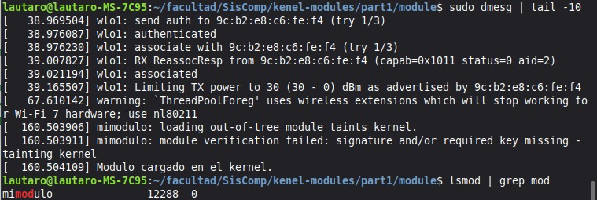
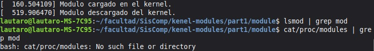

# Trabajo Práctico: Módulos de Kernel
## Parte 1 — Introducción a los Módulos de Kernel en Linux
 
---
 
## 1. Introducción
 
Un **módulo de kernel** es un fragmento de código que puede ser cargado y descargado dinámicamente en el kernel de Linux sin necesidad de reiniciar el sistema. Esta característica permite extender las funcionalidades del kernel en tiempo de ejecución, siendo la base del funcionamiento de drivers de dispositivos, sistemas de archivos y protocolos de red, entre otros.
 
A diferencia de un sistema monolítico puro, Linux permite esta modularidad manteniendo un núcleo compacto y estable, mientras que las funcionalidades adicionales se agregan según se necesiten.
 
---
 
## 2. Preparación del entorno
 
### 2.1 Instalación de dependencias
 
Para poder compilar y gestionar módulos de kernel, se instalaron las herramientas necesarias mediante el siguiente comando:
 
```bash
sudo apt-get install build-essential checkinstall kernel-package linux-source
```
 
Durante la instalación se obtuvo el siguiente mensaje de error para el paquete `kernel-package`:
 
```
Package kernel-package is not available, but is referred to by another package.
E: Package 'kernel-package' has no installation candidate
```
 
Este error es **esperado y no representa un problema**. El paquete `kernel-package` fue deprecado y eliminado de los repositorios modernos de Debian/Ubuntu (y sus derivados como Linux Mint), ya que la metodología de compilación del kernel evolucionó. Los demás paquetes (`build-essential`, `checkinstall`, `linux-source`) se instalaron correctamente.
 
El paquete verdaderamente crítico para el desarrollo de módulos es `linux-headers`, que contiene los headers del kernel actualmente en ejecución:
 
```bash
sudo apt-get install linux-headers-$(uname -r)
```
 
Los headers del kernel pueden verificarse con:
 
```bash
ls /lib/modules/$(uname -r)/build
```
 
Una salida exitosa muestra el árbol completo del código fuente del kernel:
 
```
arch    Documentation  init      Kconfig   mm              samples   tools
block   drivers        io_uring  kernel    Module.symvers  scripts   ubuntu
certs   fs             ipc       lib       net             security  usr
crypto  include        Kbuild    Makefile  rust            sound     virt
```

## 3. Compilación del módulo
 
Desde el directorio del módulo (`part1/module/`), se ejecutó el proceso de compilación:
 
```bash
cd part1
make
```
 
El comando `make` utiliza el `Makefile` del proyecto para compilar el código fuente del módulo (`.c`) y generar el archivo objeto del módulo (`.ko` — *kernel object*). Este archivo es el que puede ser cargado dinámicamente en el kernel.

## 4. Carga del módulo en el kernel
 
### 4.1 Inserción con `insmod`
 
Una vez compilado, el módulo se cargó en el kernel con:
 
```bash
sudo insmod mimodulo.ko
```
 
El comando `insmod` (*insert module*) carga el archivo `.ko` directamente en la memoria del kernel. Requiere privilegios de superusuario ya que modifica el espacio del kernel.

### 4.2 Verificación con `dmesg`
 
Para confirmar que el módulo se cargó correctamente y observar sus mensajes de inicialización, se consultó el buffer de mensajes del kernel:
 
```bash
sudo dmesg
lsmod | grep mod
```
 
`dmesg` muestra el *ring buffer* del kernel, donde se registran todos los eventos del sistema, incluyendo la carga y descarga de módulos. Al cargar un módulo que implementa la función `init_module()`, sus mensajes de log aparecen aquí.

Ademas, confirmamos la presencia del modulo utilizando lsmod, el cual lee el contenido de `/proc/modules` y muestra todos los módulos actualmente cargados en el kernel, junto con su tamaño en memoria y la cantidad de procesos que los utilizan.



## 5. Descarga del módulo del kernel
 
### 5.1 Remoción con `rmmod`
 
Para descargar el módulo de la memoria del kernel se ejecutó:
 
```bash
sudo rmmod mimodulo
```
 
El comando `rmmod` (*remove module*) elimina el módulo de la memoria del kernel, ejecutando su función `modulo_lin_clean(void)` antes de hacerlo. Nótese que no se indica la extensión `.ko`, sino solo el nombre del módulo.
 
 
### 5.2 Confirmación de la descarga
 
Se verificó la correcta remoción del módulo mediante tres comandos:
 
```bash
sudo dmesg
lsmod | grep mod
cat /proc/modules | grep mod
```
 
Los tres comandos confirmaron que el módulo ya no se encontraba cargado en el sistema:
 
- `dmesg` registró el mensaje de salida del módulo (función `modulo_lin_clean(void)`).
- `lsmod | grep mod` no arrojó resultados.
- `cat /proc/modules | grep mod` no arrojó resultados.
Esta salida es **completamente correcta**. El módulo fue eliminado de la memoria RAM del kernel. El archivo `mimodulo.ko` continúa existiendo en disco y puede volver a cargarse en cualquier momento.
 

 
---
 
## 6. Ciclo de vida de un módulo
 
El proceso realizado ilustra el ciclo de vida completo de un módulo de kernel:
 
```
  Compilación          Carga                 Descarga
      │                  │                      │
    make   ──────►   insmod    ──────────►   rmmod
      │                  │                      │
 mimodulo.ko       Vive en RAM            Eliminado de RAM
  (en disco)    (activo en kernel)     (archivo .ko persiste)
```
 
---