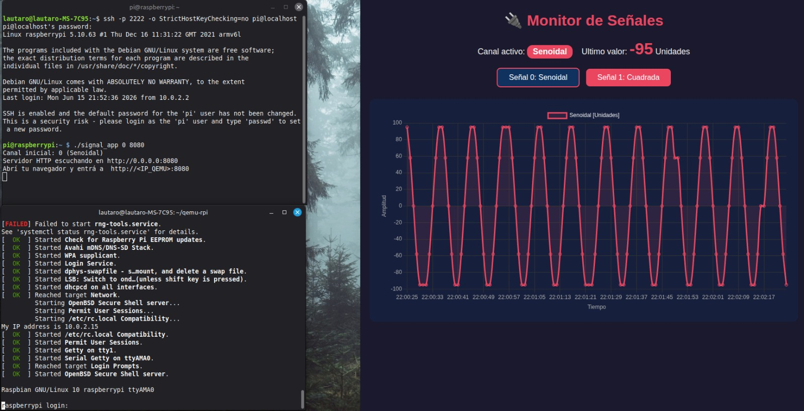

# TP5 - Character Device Driver con Señales Periódicas y Visualización Web en Tiempo Real sobre QEMU

**Sistemas de Computación** —  Facultad de Ciencias Exactas, Físicas y Naturales de Universidad Nacional de Córdoba

---

## Descripción General

Este proyecto implementa un **Character Device Driver (CDD)** del kernel de Linux que simula dos señales periódicas (senoidal y cuadrada) mediante aritmética entera, y una **aplicación en espacio de usuario** que lee el dispositivo, publica los datos por HTTP y los grafica en tiempo real en un navegador web. El sistema completo se ejecuta sobre una **Raspberry Pi emulada con QEMU**, lo que permite desarrollar y depurar un driver de kernel sin necesidad de hardware físico.

La arquitectura se divide en tres capas: (1) **Kernel Space** (ARM) — el módulo `signal_driver.ko` genera una muestra cada segundo y la expone a través de `/dev/signaldev`; (2) **User Space** (ARM) — la aplicación `signal_app` lee el driver, almacena un historial de hasta 120 muestras y sirve una interfaz web con Chart.js; (3) **Host / Navegador** — el usuario accede desde cualquier navegador al puerto 8080 redirigido por QEMU para visualizar la señal en tiempo real y alternar entre los canales senoidal y cuadrada.

---

## Requisitos Previos

| Herramienta                       | Propósito |
|-----------------------------------|-----------|
| `arm-linux-gnueabihf-gcc`         | Cross-compilador para target ARM |
| `qemu-system-arm`                 | Emulador de Raspberry Pi (modelo Versatile PB) |
| Raspberry Pi OS Lite (Buster)     | Imagen de sistema operativo para el guest ARM |
| Kernel Linux 5.10 (fuentes RPi)   | Headers del kernel para compilación del módulo |
| `scp`                             | Transferencia de archivos al guest por SSH |
| `ssh`                             | Conexión remota a QEMU (puerto 2222) |
| Navegador web                     | Visualización del gráfico en tiempo real |

---

## Estructura del Proyecto

```
TP5/
├── docs/
│   └── setup_qemu.sh         Script de descarga, configuración y lanzamiento de QEMU
├── driver/
│   ├── Makefile              Makefile para cross-compilación del módulo (Kbuild)
│   ├── signal_driver.c       Código fuente del CDD con timer, tabla seno y buffer de muestras
│   └── signal_driver.ko      Módulo compilado para ARM (prebuilt)
├── userapp/
│   ├── Makefile              Makefile para compilación cruzada de la aplicación
│   ├── signal_app.c          Código fuente: sampler thread + servidor HTTP + HTML/JS embebido
│   └── signal_app            Binario compilado para ARM (prebuilt)
├── img.jpeg                  Captura de pantalla del sistema funcionando
└── informe.md                Este documento
```

### Archivos Fuente

| Archivo | Descripción |
|---------|-------------|
| `driver/signal_driver.c` | Módulo del kernel. Usa `alloc_chrdev_region()` para major dinámico, `timer_list` con período de 1 segundo (`HZ`), `DEFINE_MUTEX` para exclusión mutua, `simple_read_from_buffer()` para lectura, y una tabla precalculada `sin_table[91]` para generar la senoidal sin punto flotante. El canal se selecciona mediante `module_param(channel_param)`. |
| `driver/Makefile` | Makefile Kbuild que invoca `make ARCH=arm ... modules` apuntando a `KDIR` (ruta de los headers del kernel ARM). |
| `userapp/signal_app.c` | Aplicación de usuario. Abre `/dev/signaldev`, lanza un hilo de muestreo (`sampler_thread`) que lee el driver cada 1 segundo y almacena hasta 120 muestras en un buffer circular con mutex. El hilo principal ejecuta un servidor HTTP en C puro que sirve una página HTML con Chart.js (CDN) y expone `GET /data` (JSON con histórico) y `POST /channel` (cambio de canal). |
| `userapp/Makefile` | Makefile para cross-compilación estática con `arm-linux-gnueabihf-gcc`, flags `-march=armv6 -marm -pthread`. |

---

## Instrucciones de Uso

### 1. Preparación del Entorno (Host)

Clonar los headers del kernel Raspberry Pi 5.10 y prepararlos para la compilación de módulos externos:

```bash
git clone --depth=1 --branch rpi-5.10.y \
    https://github.com/raspberrypi/linux ~/rpi-linux-5.10
cd ~/rpi-linux-5.10
make ARCH=arm CROSS_COMPILE=arm-linux-gnueabihf- bcmrpi_defconfig
scripts/config --disable CONFIG_FUNCTION_TRACER
scripts/config --disable CONFIG_FTRACE
make ARCH=arm CROSS_COMPILE=arm-linux-gnueabihf- olddefconfig
make ARCH=arm CROSS_COMPILE=arm-linux-gnueabihf- modules_prepare
```

### 2. Cross-Compilación del Driver y la Aplicación

```bash
# Compilar el módulo del kernel
cd TP5/driver
make ARCH=arm CROSS_COMPILE=arm-linux-gnueabihf- KDIR=~/rpi-linux-5.10

# Compilar la aplicación de usuario
cd ../userapp
make
```

### 3. Levantar QEMU

La imagen de Raspberry Pi OS Lite se descarga y configura automáticamente mediante el script `docs/setup_qemu.sh`. Para ejecutar QEMU con redirección de puertos:

```bash
qemu-system-arm \
  -kernel kernel-qemu-5.10 \
  -cpu arm1176 -m 256 -M versatilepb \
  -dtb versatile-pb.dtb \
  -no-reboot -serial stdio \
  -append "root=/dev/sda2 panic=1 rootfstype=ext4 rw" \
  -hda raspios-buster-armhf-lite.img \
  -net nic \
  -net user,hostfwd=tcp::2222-:22,hostfwd=tcp::8080-:8080 \
  -display none
```

Esto redirige el puerto **2222** del host al SSH del guest, y el **8080** del host al HTTP del guest.

### 4. Transferencia de Archivos al Guest (SCP)

```bash
scp -P 2222 driver/signal_driver.ko pi@localhost:/home/pi/
scp -P 2222 userapp/signal_app      pi@localhost:/home/pi/
```

### 5. Carga del Módulo y Ejecución (SSH en QEMU)

Conectarse por SSH y ejecutar:

```bash
ssh -p 2222 pi@localhost   # password: raspberry

# Cargar el módulo con canal 0 (senoidal)
sudo insmod signal_driver.ko channel_param=0
sudo chmod 666 /dev/signaldev

# Ejecutar la aplicación (canal 0, puerto 8080)
./signal_app 0 8080
```

Para utilizar la **señal cuadrada**, cargar el módulo con `channel_param=1`.

---

## Resultados

Una vez en ejecución, la aplicación levanta un servidor HTTP en el puerto **8080**. Desde un navegador en el host se accede a `http://localhost:8080` y se observa:

- **Gráfico en tiempo real** con Chart.js que se actualiza cada 1 segundo (*polling* a `GET /data`).
- **Indicador del canal activo** y el último valor muestreado.
- **Botones para alternar** entre la señal senoidal (canal 0, amplitud ±100, período 10 s) y la cuadrada (canal 1, amplitud ±100, duty cycle 50%, período 2 s).



*Imagen superior: terminal SSH conectada a QEMU ejecutando `./signal_app 0 8080` en el canal 0 (senoidal). Inferior: navegador web mostrando el gráfico en tiempo real generado con Chart.js sobre fondo oscuro, con el eje temporal en el eje X y la amplitud en el eje Y. Se confirma el correcto funcionamiento del pipeline completo: kernel → user space → navegador.*

---

> **Materia:** Sistemas de Computación — FCEFyN - UNC
